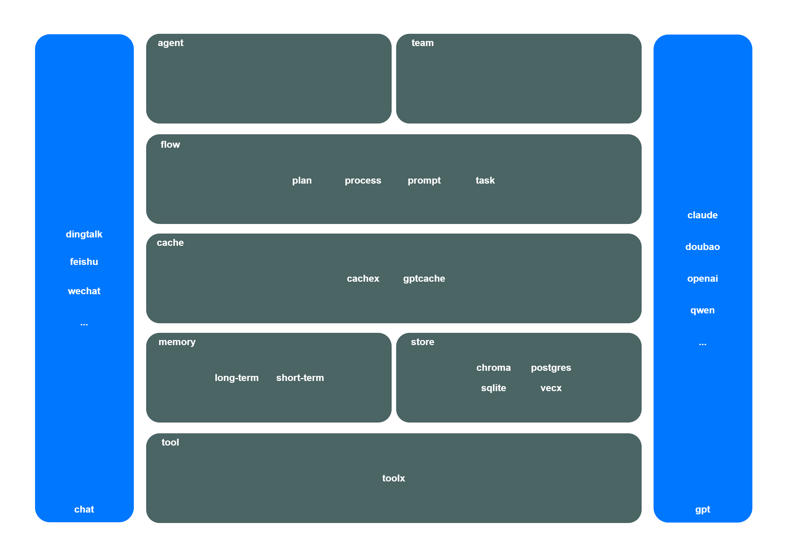

# flowx

[](https://github.com/ai-flowx/flowx/actions?query=workflow%3Aci)
[](https://hub.docker.com/r/craftslab/flowx)
[](https://goreportcard.com/report/github.com/ai-flowx/flowx)
[](https://github.com/ai-flowx/flowx/blob/main/LICENSE)
[](https://github.com/ai-flowx/flowx/tags)


## Introduction

*flowx* is the ai framework of [ai-flowx](https://github.com/ai-flowx) written in Go.


## Prerequisites

- Go >= 1.22.0


## Build

```bash
version=latest make build
```


## Usage

```
Usage:
  flowx [flags]

Flags:
  -c, --config-file string   config file
  -h, --help                 help for flowx
  -l, --listen-port string   listen port (default ":8080")
  -v, --version              version for flowx
```


## Settings

*flowx* parameters can be set in the directory [config](https://github.com/ai-flowx/flowx/blob/main/config).

An example of configuration in [config.yml](https://github.com/ai-flowx/flowx/blob/main/config/config.yml):

```yaml
cache:
  provider: cachex
  host: 127.0.0.1
  port: 8081
  user: user
  pass: pass
flow:
  channel: wechat
gpt:
  provider: doubao-chat
  api: https://ark.cn-beijing.volces.com/api/v3/chat/completions
  key: 8429f8ab-*
  endpoint: ep-*
memory:
  type: shortterm
prompt:
  provider: promptx
  host: 127.0.0.1
  port: 8082
  user: user
  pass: pass
store:
  provider: vecx
  host: 127.0.0.1
  port: 8083
  path: /path/to/file
  user: user
  pass: pass
tool:
  - name: gerrit
  - name: hello
```


## Architecture




## Features

- **Role-Based Agents**

  Create specialized agents with defined roles, expertise, and goals


- **Flexible Tools**

  Equip agents with custom tools and APIs to interact with external services and data sources


- **Intelligent Collaboration**

  Agents work together, sharing insights and coordinating tasks to achieve complex objectives


- **Task Management**

  Define sequential or parallel workflows, with agents automatically handling task dependencies


## License

Project License can be found [here](LICENSE).


## Reference

### Binding

- [gopy](https://github.com/go-python/gopy)

### Chat

- [dify-on-wechat](https://docs.dify.ai/zh-hans/learn-more/use-cases/dify-on-wechat)
- [dify-on-wechat](https://github.com/hanfangyuan4396/dify-on-wechat/blob/master/channel/wechat/wechat_channel.py)
- [openwechat](github.com/eatmoreapple/openwechat)

### Framework

- [autogen](https://github.com/microsoft/autogen)
- [cobra-cli](https://github.com/spf13/cobra-cli)
- [crewai](https://github.com/crewAIInc/crewAI)
- [dockerfile](https://docs.docker.com/reference/dockerfile/)
- [fabric](https://github.com/danielmiessler/fabric)
- [langchain-agents](https://www.langchain.com/agents)
- [langgraph](https://langchain-ai.github.io/langgraph/)
- [llama-agents](https://github.com/run-llama/llama-agents)
- [modelfile](https://github.com/ollama/ollama/blob/main/docs/modelfile.md)
- [semantic-kernel](https://github.com/microsoft/semantic-kernel)

### Memory

- [memoryrepository-for-ai-npc](https://ieeexplore.ieee.org/document/10508558)
- [memoryrepository-for-ai-npc](https://github.com/Formyselfonly/MemoryRepository_for_AI_NPC)

### Protocol

- [claude-mcp](https://ai-claude.net/mcp/)
- [claude-mcp-servers](https://github.com/modelcontextprotocol/servers)
- [langgraph-agent-protocol](https://github.com/langchain-ai/agent-protocol)

### Store

- [chroma-go](https://github.com/amikos-tech/chroma-go)
- [setting-up-postgresql-server-in-docker-container-on-ubuntu](https://medium.com/@maheshshelke/setting-up-postgresql-server-in-docker-container-on-ubuntu-a-step-by-step-guide-f21f8973d6d7)

### Tools

- [crewai-tools](https://docs.crewai.com/concepts/tools)
- [crewai-tools](https://github.com/crewAIInc/crewAI-tools)
- [langchain-tools](https://python.langchain.com/docs/integrations/tools/)
- [langchaingo](https://github.com/tmc/langchaingo)
